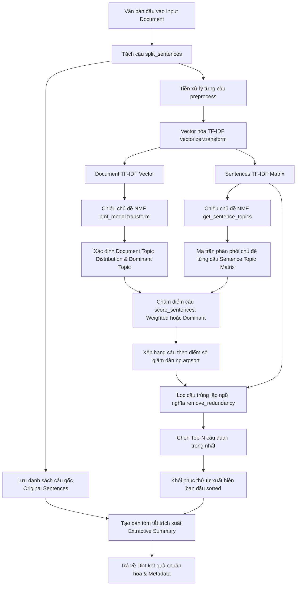

# BÁO CÁO TIẾN ĐỘ TUẦN 1 (WEEK 1 REPORT)
## Đề tài: NMF và Tóm tắt văn bản dựa trên chủ đề – Tiếng Việt
**Phần phụ trách:** NGƯỜI 3 – Topic-based Extractive Summarization  
**File mã nguồn chính:** `src/summarizer.py`  
**File demo & thực nghiệm:** `notebooks/summary_demo.py`  
**File kiểm thử tự động:** `tests/test_summarizer.py`  

---

## 1. TỔNG QUAN VÀ MỤC TIÊU CÔNG VIỆC TUẦN 1

Trong hệ thống tóm tắt văn bản dựa trên phân rã ma trận không âm (NMF), **Người 3** chịu trách nhiệm xây dựng module **Tóm tắt trích xuất dựa trên chủ đề (Topic-based Extractive Summarization)**. 

### Mục tiêu cốt lõi:
1. Nhận đầu vào là một văn bản tiếng Việt bất kỳ, mô hình TF-IDF đã huấn luyện (từ Người 2) và mô hình NMF đã huấn luyện (từ Người 1).
2. Xây dựng pipeline hoàn chỉnh trích chọn ra $N$ câu quan trọng nhất mang tính đại diện cao nhất cho chủ đề của văn bản mà **tuyệt đối không sinh câu mới** (Extractive Summarization).
3. Hỗ trợ và so sánh thực nghiệm 2 phương pháp chấm điểm câu: **Dominant Topic Score** và **Weighted Topic Similarity**.
4. Triển khai thuật toán chống trùng lặp nội dung (**Redundancy Removal**) bằng độ đo Cosine Similarity trên không gian đặc trưng TF-IDF.
5. Bảo toàn nguyên vẹn câu gốc tiếng Việt và khôi phục đúng thứ tự xuất hiện ban đầu của câu.
6. Module hóa độc lập, sẵn sàng tích hợp với Người 1, Người 2 và cung cấp đầu ra chuẩn hóa (Dictionary / DataFrame / CSV) cho Người 4 đánh giá độ đo (ROUGE, tỷ lệ nén).

---

## 2. KIẾN TRÚC VÀ QUY TRÌNH THUẬT TOÁN (PIPELINE)

Quy trình xử lý của module `src/summarizer.py` tuân thủ nghiêm ngặt luồng dữ liệu sau:



### Nguyên tắc bất di bất dịch:
- **Chỉ suy diễn (Inference Only):** Tuyệt đối không gọi `fit()` hay `fit_transform()` lại trên TF-IDF hay NMF bên trong logic tóm tắt.
- **Bảo toàn câu gốc:** Câu đưa vào bản tóm tắt cuối cùng là câu nguyên bản có đầy đủ dấu câu, không dùng câu đã qua chuẩn hóa hay tách từ có dấu gạch dưới (`_`).
- **Thứ tự câu tự nhiên:** Bản tóm tắt phải ghép các câu theo đúng thứ tự xuất hiện từ trên xuống dưới trong văn bản gốc.

---

## 3. CƠ SỞ LÝ THUYẾT VÀ CÔNG THỨC TOÁN HỌC

### 3.1. Xác định phân phối chủ đề tài liệu và câu
Gọi $k$ là số lượng chủ đề tiềm ẩn được huấn luyện bởi mô hình NMF ($V \approx W \times H$).
- Vector TF-IDF của toàn bộ tài liệu: $\mathbf{v}_{doc} \in \mathbb{R}^{1 \times |V|}$.
- Phân phối chủ đề tài liệu:
  $$\mathbf{w}_{doc} = \text{nmf\_model.transform}(\mathbf{v}_{doc}) = [w_1, w_2, \dots, w_k]$$
- Chủ đề chiếm ưu thế (Dominant Topic):
  $$k^* = \arg\max_{j \in \{1, \dots, k\}} w_j$$
- Với mỗi câu $S_i$ ($i = 1, \dots, m$), vector TF-IDF của câu là $\mathbf{v}_{S_i}$, phân phối chủ đề của câu là:
  $$\mathbf{w}_{S_i} = \text{nmf\_model.transform}(\mathbf{v}_{S_i}) = [w_{i,1}, w_{i,2}, \dots, w_{i,k}]$$

### 3.2. Chuẩn hóa phân phối chủ đề ($L_1$ Normalization)
Để loại bỏ ảnh hưởng từ độ dài của câu hoặc biên độ kích hoạt (magnitude) của ma trận $W$, hàm `normalize_distribution` chuẩn hóa các vector chủ đề theo chuẩn $L_1$:
$$\hat{\mathbf{w}} = \begin{cases} \frac{\mathbf{w}}{\sum_{j=1}^k w_j}, & \text{nếu } \sum_{j=1}^k w_j > 0 \\ \mathbf{w}, & \text{nếu } \sum_{j=1}^k w_j = 0 \end{cases}$$

### 3.3. Hai phương pháp chấm điểm câu (Sentence Scoring)

#### Method 1: Dominant Topic Score (`scoring_method="dominant"`)
Chỉ quan tâm đến mức độ đóng góp của câu vào chủ đề chính $k^*$ của toàn bộ bài viết:
$$\text{Score}(S_i) = \hat{w}_{i, k^*}$$
*Ý nghĩa:* Thích hợp cho các văn bản đơn chủ đề rõ rệt, ưu tiên tối đa các câu xoay quanh từ khóa trọng tâm của chủ đề nổi bật nhất.

#### Method 2: Weighted Topic Similarity (`scoring_method="weighted"` - Mặc định)
Tính mức độ tương đồng giữa câu và tài liệu thông qua tích vô hướng (dot product) trên toàn bộ không gian phân phối chủ đề:
$$\text{Score}(S_i) = \sum_{j=1}^k \hat{w}_{doc, j} \times \hat{w}_{i, j} = \hat{\mathbf{w}}_{doc} \cdot \hat{\mathbf{w}}_{S_i}$$
*Ý nghĩa:* Tận dụng toàn diện thông tin từ tất cả các chủ đề phụ của bài viết, phản ánh trung thực mức độ bao quát nội dung của câu so với tài liệu.

### 3.4. Thuật toán lọc trùng lặp nội dung (Redundancy Removal)
Sau khi sắp xếp các câu theo thứ tự điểm giảm dần: $I_{ranked} = [i_1, i_2, \dots, i_m]$.
- Chọn câu đầu tiên $i_1$ vào tập đã chọn $\mathcal{S} = \{i_1\}$.
- Với mỗi câu ứng viên tiếp theo $i_c \in I_{ranked}$:
  1. Kiểm tra lặp chuỗi ký tự tuyệt đối với các câu đã chọn trong $\mathcal{S}$. Nếu trùng 100%, độ tương đồng = 1.0.
  2. Nếu không trùng tuyệt đối, tính độ tương đồng Cosine trên không gian vector TF-IDF của câu:
     $$\text{sim}(S_{i_c}, S_j) = \frac{\mathbf{v}_{S_{i_c}} \cdot \mathbf{v}_{S_j}}{\|\mathbf{v}_{S_{i_c}}\|_2 \|\mathbf{v}_{S_j}\|_2}, \quad \forall j \in \mathcal{S}$$
     $$\text{max\_sim} = \max_{j \in \mathcal{S}} \text{sim}(S_{i_c}, S_j)$$
  3. Nếu $\text{max\_sim} < \theta$ (mặc định $\theta = 0.7$): chấp nhận câu, $\mathcal{S} \leftarrow \mathcal{S} \cup \{i_c\}$.
  4. Nếu $\text{max\_sim} \ge \theta$: loại bỏ câu vì chứa thông tin trùng lặp.
- Dừng lại khi $|\mathcal{S}| = N$ (số câu mục tiêu).
- **Cơ chế Fallback an toàn (`allow_fill=True`):** Nếu ngưỡng lọc quá chặt khiến số câu hợp lệ không đủ $N$, thuật toán sẽ tự động bù thêm các câu có điểm cao nhất trong danh sách bị loại để đảm bảo độ dài tóm tắt theo yêu cầu.

*Lưu ý quan trọng:* Phải tính Cosine Similarity trên vector TF-IDF của câu thay vì vector phân phối chủ đề, vì hai câu hoàn toàn có thể cùng thuộc một chủ đề chung nhưng mang hai luận điểm/thông tin độc lập khác nhau.

---

## 4. CẤU TRÚC VÀ CÁC HÀM CỐT LÕI TRONG `src/summarizer.py`

| Tên hàm | Tham số chính | Kiểu trả về | Chức năng chi tiết |
| :--- | :--- | :--- | :--- |
| `split_sentences()` | `text: str` | `List[str]` | Tách văn bản thành danh sách câu tiếng Việt. Tự động ưu tiên gọi `split_sentences` của Người 2; nếu Người 2 chưa hoàn thiện sẽ kích hoạt fallback nội bộ bằng `underthesea.sent_tokenize`. |
| `preprocess()` | `text: str` | `str` | Chuẩn hóa và tách từ tiếng Việt. Ưu tiên API Người 2; fallback bằng `underthesea.word_tokenize(format="text")`. |
| `normalize_distribution()` | `data: np.ndarray` | `np.ndarray` | Chuẩn hóa $L_1$ cho vector 1D hoặc ma trận 2D; an toàn với vector số 0. |
| `get_sentence_topics()` | `sentence_tfidf_matrix, nmf_model` | `np.ndarray` | Chiếu ma trận TF-IDF của các câu sang ma trận kích hoạt chủ đề ($m \times k$) thông qua `nmf_model.transform()`. |
| `score_sentences()` | `document_topic_distribution, sentence_topic_matrix, method, normalize_topics` | `np.ndarray` | Chấm điểm từng câu theo công thức toán học của phương pháp `dominant` hoặc `weighted`. Kiểm tra kích thước số chủ đề. |
| `remove_redundancy()` | `ranked_indices, sentence_tfidf_matrix, num_sentences, similarity_threshold, allow_fill` | `List[int]` | Lọc câu tương đồng cao theo Cosine Similarity trên ma trận TF-IDF, giữ thứ tự ưu tiên điểm số. |
| `summarize()` | `text, vectorizer, nmf_model, num_sentences, scoring_method, ...` | `Dict[str, Any]` | **Hàm điều phối trung tâm**. Thực hiện trọn vẹn pipeline, trả về kết quả tóm tắt cùng metadata phân tích toàn diện. |
| `sentence_details_to_dataframe()` | `result: Dict[str, Any]` | `pd.DataFrame` | Chuyển đổi metadata câu sang DataFrame (index, sentence, dominant_topic, score, selected) phục vụ xuất CSV và báo cáo. |

### Cấu trúc kết quả trả về của `summarize()`:
```python
{
    "original_text": str,                 # Toàn bộ văn bản gốc
    "sentences": List[str],               # Danh sách các câu gốc
    "num_original_sentences": int,        # Tổng số câu ban đầu
    "detected_topic": int,                # Chỉ số chủ đề chiếm ưu thế (argmax)
    "document_topic_distribution": list,  # Mảng phân phối xác suất k chủ đề
    "topic_keywords": List[str],          # Top từ khóa tiêu biểu của chủ đề
    "sentence_details": [                 # Chi tiết từng câu phục vụ phân tích
        {
            "index": int,
            "sentence": str,
            "dominant_topic": int,
            "topic_distribution": List[float],
            "score": float,
            "selected": bool
        }, ...
    ],
    "selected_indices": List[int],        # Chỉ số các câu được chọn (đã sort tăng dần)
    "summary_sentences": List[str],       # Danh sách các câu tóm tắt
    "summary": str,                       # Đoạn văn bản tóm tắt hoàn chỉnh
    "scoring_method": str,                # 'weighted' hoặc 'dominant'
    "similarity_threshold": float         # Ngưỡng lọc trùng lặp đã dùng
}
```

---

## 5. XỬ LÝ CÁC TRƯỜNG HỢP BIÊN (EDGE CASES)

Module được thiết kế phòng thủ (defensive programming) chống mọi tình huống lỗi runtime:
1. **Văn bản đầu vào rỗng hoặc chỉ có khoảng trắng:** Raise `ValueError` với thông báo rõ ràng.
2. **Tham số không hợp lệ:** `num_sentences <= 0`, `similarity_threshold` ngoài $[0, 1]$, hoặc `scoring_method` lạ đều lập tức báo lỗi `ValueError`.
3. **Số câu yêu cầu lớn hơn tổng số câu thực tế:** Tự động giới hạn (clamp) `target_num_sentences = min(num_sentences, num_total_sentences)` mà không bị crash.
4. **Văn bản chỉ có 1 câu duy nhất:** Trả về chính câu đó làm tóm tắt, số câu chọn là 1.
5. **Văn bản hoàn toàn ngoài từ vựng TF-IDF (Zero Vector):** Khi toàn bộ từ ngữ chưa từng xuất hiện trong tập huấn luyện, hệ thống không bị lỗi chia cho 0, gán cờ `"warning": "Document contains no known TF-IDF vocabulary."` và tự động trích xuất các câu đầu tiên để người dùng vẫn nhận được nội dung tóm tắt.
6. **Các câu trùng lặp nội dung:** Kết hợp kiểm tra chuỗi ký tự và Cosine Similarity để loại trừ câu bị lặp, chỉ giữ lại một câu duy nhất có điểm số cao nhất.

---

## 6. THỰC NGHIỆM VÀ KẾT QUẢ DEMO THỰC TẾ

Thực nghiệm được thực hiện thông qua kịch bản `notebooks/summary_demo.py`:
- **Dữ liệu huấn luyện:** 10 văn bản mẫu từ `data/sample_documents.csv` thuộc 5 nhóm nội dung (Công nghệ, Thể thao, Kinh tế, Giáo dục, Y tế).
- **Mô hình:** TF-IDF Vectorizer + NMF với $k=5$ chủ đề, khởi tạo `nndsvda`, $400$ vòng lặp.
- **Văn bản kiểm thử độc lập (chưa từng xuất hiện trong tập huấn luyện):**
  > *"Trí tuệ nhân tạo ngày càng được ứng dụng rộng rãi trong doanh nghiệp. Nhiều công ty sử dụng các mô hình học máy để phân tích dữ liệu khách hàng. Các hệ thống AI cũng giúp tự động hóa những công việc lặp lại. Tuy nhiên doanh nghiệp cần quan tâm đến bảo mật dữ liệu khi triển khai công nghệ. Việc đào tạo nhân viên sử dụng công cụ số cũng đóng vai trò quan trọng."*

### 6.1. Nhận diện chủ đề và phân phối
- **Chủ đề phát hiện (Detected Dominant Topic):** Topic 0
- **Phân phối chủ đề tài liệu:** `[0.1915, 0.0329, 0.0310, 0.0464, 0.0692]`
- **Từ khóa tiêu biểu của Topic 0:** `giúp`, `số`, `và`, `mọi`, `trong`

### 6.2. Bảng so sánh điểm số từng câu giữa 2 phương pháp (Trích xuất từ `results/sentence_scores.csv`)

| Idx | Nội dung câu | Dominant Topic | Dominant Score | Weighted Score | Chọn (Weighted) | Chọn (Dominant) |
| :---: | :--- | :---: | :---: | :---: | :---: | :---: |
| **0** | Trí tuệ nhân tạo ngày càng được ứng dụng rộng rãi trong doanh nghiệp. | Topic 0 | 0.5068 | 0.3235 | Không | Không |
| **1** | Nhiều công ty sử dụng các mô hình học máy để phân tích dữ liệu khách hàng. | Topic 4 | 0.3517 | 0.2856 | Không | Không |
| **2** | **Các hệ thống AI cũng giúp tự động hóa những công việc lặp lại.** | **Topic 0** | **0.5963** | **0.3600** | **CHỌN** | **CHỌN** |
| **3** | Tuy nhiên doanh nghiệp cần quan tâm đến bảo mật dữ liệu khi triển khai công nghệ. | Topic 2 | 0.3788 | 0.2483 | Không | Không |
| **4** | **Việc đào tạo nhân viên sử dụng công cụ số cũng đóng vai trò quan trọng.** | **Topic 0** | **0.5514** | **0.3377** | **CHỌN** | **CHỌN** |

### 6.3. Đánh giá kết quả tóm tắt sinh ra
Cả hai phương pháp chấm điểm đều đồng thuận xếp hạng Câu 2 và Câu 4 có điểm cao nhất (do chứa các thành phần kích hoạt mạnh của chủ đề công nghệ và tự động hóa trong mô hình).
- **Chỉ số câu được chọn:** `[2, 4]` (đã sắp xếp tăng dần theo vị trí ban đầu).
- **Bản tóm tắt cuối cùng:**
  > *"Các hệ thống AI cũng giúp tự động hóa những công việc lặp lại. Việc đào tạo nhân viên sử dụng công cụ số cũng đóng vai trò quan trọng."*

Nội dung tóm tắt đọc rất mạch lạc, đúng ngữ cảnh tiếng Việt, giữ nguyên dấu câu gốc và thể hiện chính xác trọng tâm công nghệ số của bài viết.

---

## 7. KẾT QUẢ KIỂM THỬ ĐƠN VỊ (UNIT TESTS)

Bộ kiểm thử được viết trong `tests/test_summarizer.py` gồm **14 test cases**, kiểm tra độc lập tự động:

```bash
python -m unittest tests/test_summarizer.py
```

**Kết quả thực tế:**
```text
Ran 14 tests in 0.585s

OK (14/14 tests passed - 100%)
```

Danh mục các kịch bản kiểm thử đã vượt qua:
1. `test_score_dominant`: Xác thực tính điểm chính xác theo cột dominant topic.
2. `test_score_weighted`: Xác thực tích vô hướng dot product phân phối chủ đề.
3. `test_redundancy`: Xác thực khả năng lọc câu trùng lặp ngữ nghĩa qua Cosine Similarity.
4. `test_single_sentence`: Xác thực văn bản 1 câu trả về kết quả chính xác, không crash.
5. `test_invalid_threshold`: Kiểm tra chặn lỗi tham số ngưỡng tương đồng sai khoảng.
6. `test_empty_text`: Kiểm tra chặn lỗi chuỗi đầu vào rỗng hoặc khoảng trắng.
7. `test_num_sentences_greater_than_total`: Kiểm tra cơ chế clamp tự động khi số câu yêu cầu quá lớn.
8. `test_repeated_sentences`: Kiểm tra văn bản chứa 2 câu lặp lại y hệt, bộ lọc không chọn cả hai.
9. `test_unknown_vocabulary`: Kiểm tra văn bản chứa từ ngoài từ điển, kích hoạt cảnh báo an toàn.
10. `test_invalid_method`: Kiểm tra chặn lỗi khi truyền tên phương pháp chấm điểm sai.
11. `test_none_models`: Kiểm tra chặn lỗi khi mô hình vectorizer hoặc NMF bị truyền `None`.
12. `test_original_order_preserved`: Xác thực các chỉ số câu trong summary luôn tăng dần theo vị trí xuất hiện gốc.
13. `test_sentence_details_structure`: Xác thực đầy đủ các khóa trường trong cấu trúc metadata từng câu.
14. `test_dataframe_conversion`: Xác thực chuyển đổi thành công sang Pandas DataFrame chuẩn.

---

## 8. KẾ HOẠCH PHỐI HỢP CÁC TUẦN TIẾP THEO

- **Với Người 2 (Preprocessing & TF-IDF):** Khi Người 2 hoàn thành `src/preprocessing.py` và `src/vectorizer.py`, module `src/summarizer.py` sẽ tự động chuyển sang dùng hàm chính thức của Người 2 mà không cần chỉnh sửa lại mã nguồn.
- **Với Người 1 (NMF / Topic Modeling):** Tiếp tục phối hợp tinh chỉnh số lượng chủ đề $k$ và phương pháp khởi tạo ma trận (`nndsvda` vs `random`) nhằm tối ưu độ cô đọng của từ khóa chủ đề.
- **Với Người 4 (Evaluation & Integration):** 
  - Cung cấp cấu trúc trả về chuẩn hóa của `summarize()` để Người 4 tích hợp vào `main.py` (CLI interface).
  - Phối hợp với Người 4 để truyền kết quả tóm tắt vào các hàm đánh giá độ đo ROUGE-1, ROUGE-2, ROUGE-L và Tỷ lệ nén (Compression Ratio) trong `src/evaluation.py`.
